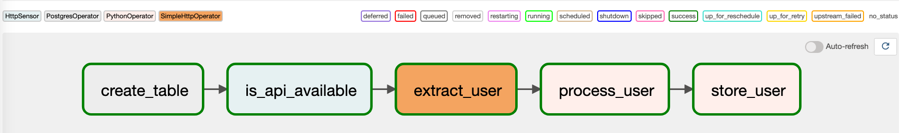
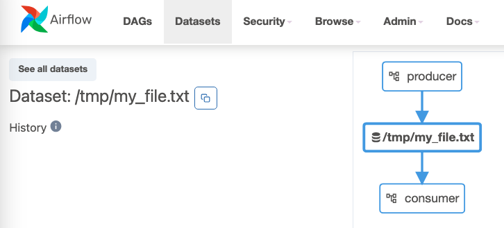

# Airflow-Course
Notes and codes of following along with Marc Lamberti's course: "The Complete Hands-On Introduction to Apache Airflow" on Udemy

---

- Scheduler 針對 DAG 的更新頻率
    - 每 5 分鐘檢查一次是否有新增的 DAG
    - 每 30 秒檢查現有 DAG 是否有修改
    - 實際測試：好像更新速度比上述快

- Providers 是用來連結 Airflow 和其他外部服務，例如：
    - AWS: `pip install apache-airlfow-providers-amazon`
    - Databricks: `pip install apache-airlfow-providers-databricks`
    - DBT: `pip install apache-airlfow-providers-dbt=cloud`

- 驗證 DAG
    - ```airflow tasks test <DAG_ID> <TASK_ID> <DATE_PAST>```
    - Example:
        ```bash
        $ airflow tasks test user_processing create_table 2022-01-01
        ```

## Assign more memory to Docker container

- Airflow 至少需要 4.0 GB 來跑，但 Docker 預設是讓 container 只使用到 2.0 GB
所以需要另外調整

- 點擊右上角的齒輪，會進入到 Preferences 設定頁面，點選 Resources，可以看到 Memory 預設是 2.0 GB


- 直接調整到 8.0 GB


## Writing a DAG
1. Import the DAG object
2. Instantiate a the DAG object
3. Define a unique dag id
4. Define a start date
5. Define a scheduled interval
6. Define the catchup parameter

## Create connections

| Connection | Information |
| ---- | ---- |
| Connection Id | `postgres`|
| Connection Type | `postgres`|
| Host | `postgres`|
| Login | `airflow`|
| Password | `airflow`|

| Add Connection | Information |
| ---- | ---- |
| Connection Id | `user_api`|
| Connection Type | `HTTP`|
| Host | `https://randomuser.me/`|

## DAGs

### `user_process`



Practice point:
- PostgresOperator
- HttpSensor
- SimpleHttpOperator
- PythonOperator

### `producer`, `consumer`



Practice point:
- Datasets
  - If one task succeeded, another DAG which depends on `my_file` dataset will be triggered!
- Also can wait for multiple files by `DAG(schedule=[my_file, my_file_2])`
- Limitations:
  - Consumer DAGs are triggered every time a task that updates datasets completes successfully. Airflow doesn't check whether the data has been effectively updated.
  - You can't combine different schedules like datasets with cron expressions.
  - If two tasks update the same dataset, as soon as one is done, that triggers the Consumer DAG immediately without waiting for the second task to complete.
  - Airflow monitors datasets only within the context of DAGs and Tasks. If an external tool updates the actual data represented by a Dataset, Airflow has no way of knowing that.