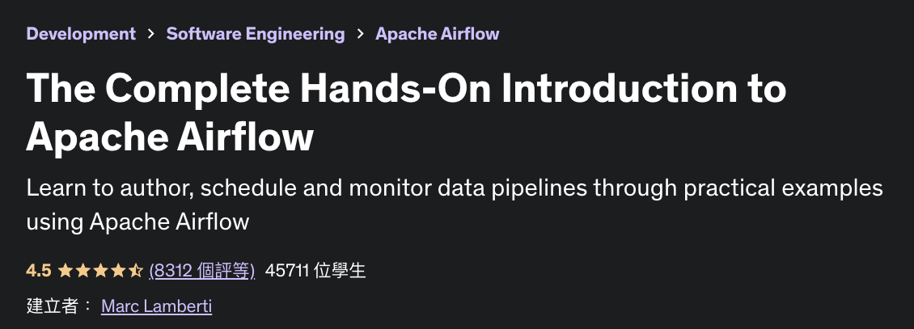
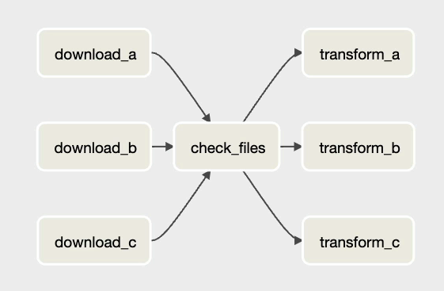
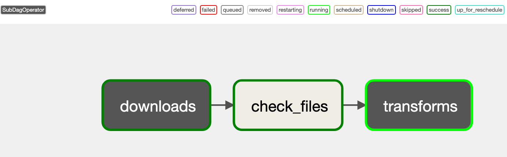

# Airflow-Course
Notes and codes of following along with Marc Lamberti's course: "*[The Complete Hands-On Introduction to Apache Airflow](https://www.udemy.com/course/the-complete-hands-on-course-to-master-apache-airflow/)*" on Udemy



- [Airflow-Course](#airflow-course)
  - [Section 2: Getting Started Wtih Airflow](#section-2-getting-started-wtih-airflow)
    - [Assign more memory to Docker container](#assign-more-memory-to-docker-container)
  - [Section 4: Coding Your First Data Pipeline With Airflow](#section-4-coding-your-first-data-pipeline-with-airflow)
    - [Steps to write a DAG](#steps-to-write-a-dag)
    - [Create connections](#create-connections)
    - [DAG: `user_process`](#dag-user_process)
  - [Section 5: The New Way of Scheduling DAGs](#section-5-the-new-way-of-scheduling-dags)
    - [DAG: `producer`, `consumer`](#dag-producer-consumer)
  - [Section 6: Databases and Executors](#section-6-databases-and-executors)
    - [Executors](#executors)
      - [Sequential Executor](#sequential-executor)
      - [Local Executor](#local-executor)
      - [CeleryExecutor:](#celeryexecutor)
      - [Check what executor you are using](#check-what-executor-you-are-using)
  - [Section 7： Implementing Advanced Concepts in Airflow](#section-7-implementing-advanced-concepts-in-airflow)
    - [Subdags](#subdags)
      - [DAGs: `group_dag`, `subdags/subdag_downloads.py`, `subdags/subdag_transforms.py`](#dags-group_dag-subdagssubdag_downloadspy-subdagssubdag_transformspy)

---
## Section 2: Getting Started Wtih Airflow

- Scheduler 針對 DAG 的更新頻率
    - 每 5 分鐘檢查一次是否有新增的 DAG
    - 每 30 秒檢查現有 DAG 是否有修改
    - 實際測試：好像更新速度比上述快

- Providers 是用來連結 Airflow 和其他外部服務，例如：
    - AWS: `pip install apache-airlfow-providers-amazon`
    - Databricks: `pip install apache-airlfow-providers-databricks`
    - DBT: `pip install apache-airlfow-providers-dbt=cloud`

- 驗證 DAG
    - ```airflow tasks test <DAG_ID> <TASK_ID> <DATE_PAST>```
    - Example:
        ```bash
        $ airflow tasks test user_processing create_table 2022-01-01
        ```

### Assign more memory to Docker container

- Airflow 至少需要 4.0 GB 來跑，但 Docker 預設是讓 container 只使用到 2.0 GB
所以需要另外調整

- 點擊右上角的齒輪，會進入到 Preferences 設定頁面，點選 Resources，可以看到 Memory 預設是 2.0 GB


- 直接調整到 8.0 GB


## Section 4: Coding Your First Data Pipeline With Airflow

### Steps to write a DAG

1. Import the DAG object
2. Instantiate a the DAG object
3. Define a unique dag id
4. Define a start date
5. Define a scheduled interval
6. Define the catchup parameter

### Create connections

| Connection | Information |
| ---- | ---- |
| Connection Id | `postgres`|
| Connection Type | `postgres`|
| Host | `postgres`|
| Login | `airflow`|
| Password | `airflow`|

| Add Connection | Information |
| ---- | ---- |
| Connection Id | `user_api`|
| Connection Type | `HTTP`|
| Host | `https://randomuser.me/`|

### DAG: `user_process`


Practice point:
- PostgresOperator
- HttpSensor
- SimpleHttpOperator
- PythonOperator

## Section 5: The New Way of Scheduling DAGs
### DAG: `producer`, `consumer`


Practice point:
- Datasets
  - If one task succeeded, another DAG which depends on `my_file` dataset will be triggered!
- Also can wait for multiple files by `DAG(schedule=[my_file, my_file_2])`
- Limitations:
  - Consumer DAGs are triggered every time a task that updates datasets completes successfully. Airflow doesn't check whether the data has been effectively updated.
  - You can't combine different schedules like datasets with cron expressions.
  - If two tasks update the same dataset, as soon as one is done, that triggers the Consumer DAG immediately without waiting for the second task to complete.
  - Airflow monitors datasets only within the context of DAGs and Tasks. If an external tool updates the actual data represented by a Dataset, Airflow has no way of knowing that.

## Section 6: Databases and Executors

### Executors
An Executor doesn't execute tasks, only defines HOW to run tasks (on which system).

#### Sequential Executor 
- Run 1 task at a time
- Use SQLite Database
- SQLite only accept 1 writer at a time. (but unlimited readers)
  - That's why we can't use SQLite database with local executors or celery executors.
- Helpful to use it during debugging process.

#### Local Executor
-  Run multiple tasks at a time on 1 machine. (Parallelism)
-  Use PostgreSQL, MySQL...(but not SQLite)

#### CeleryExecutor: 
- Run multiple tasks at the same time on multiple machines. (Parallelism)
- `RESULT_BACKEND=postgreSQL`: Stores states of tasks which have been executed.
- `BROKER=redis`: The task queue sent by Scheduler for workers to execute.
- Can manage and monitor by Flower. To start Flower:
  ```bash
  docker compose down && docker compose --profile flower up -d
  ```
  

#### Check what executor you are using
- In `airflow.cfg`:
  ```bash
  docker cp airflow-course-airflow-scheduler-1:/opt/airflow/airflow.cfg .
  ```
- BUT `docker-compose.yml` will override `airflow.cfg` configurations.
- Example: `AIRFLOW__CORE__EXECUTOR: CeleryExecutor` means setting Airflow config section `[core]`'s `EXECUTOR` value to `CeleryExecutor`

## Section 7： Implementing Advanced Concepts in Airflow

### Subdags

- Can group dags with same logic into one subdag
- Easier to read and maintain
- Before using subdag
  
  

- After using subdag

  

#### DAGs: `group_dag`, `subdags/subdag_downloads.py`, `subdags/subdag_transforms.py`

Practice point:
- SubDagOperator
